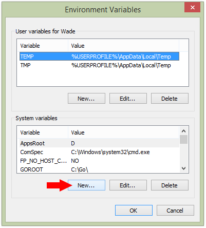
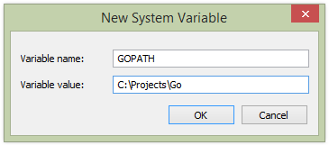

# How to install Golang

## Linux
1. Download Golang (https://golang.org/dl/)
2. Extract to `/usr/local`
`tar -C /usr/local xzvf go1.8.1.linux-amd64.tar.gz`
3. Create folder Projects
`mkdir -p ~/Projects/Go`
4. Configuration env, open `~/.bashrc`
`
export GOROOT=/usr/local/go
export GOPATH=$HOME/Projects/Go
export PATH=$GOPATH/bin:$GOROOT/bin:$PATH
`
5. After save, run type `source ~/.bashrc`
6. Check with `go version`

## Windows

1. Install the latest 64-bit Go MSI (https://golang.org/dl/)
2. Ensure the Go binaries in `C:\Go\bin` and in your environment. To check click `System, Advanced system settings, Environment Variables... and open Path under System variables`
3. Open Command Line (CMD) and type `go version`

### Setup Workspace
1. Create folder `bin`, 'pkg', 'src' in `C:\Projects\Go`
2. Create the *GOPATH environment variable* and reference your Go workspace path. To add, click `System, Advanced system settings, Environment Variables...` and click `New... under System variables`:

Set the variable name to GOPATH and value to your Go workspace path (e.g. C:\Projects\Go):

4. Check in Command line (cmd) and type `echo %GOPATH%`
